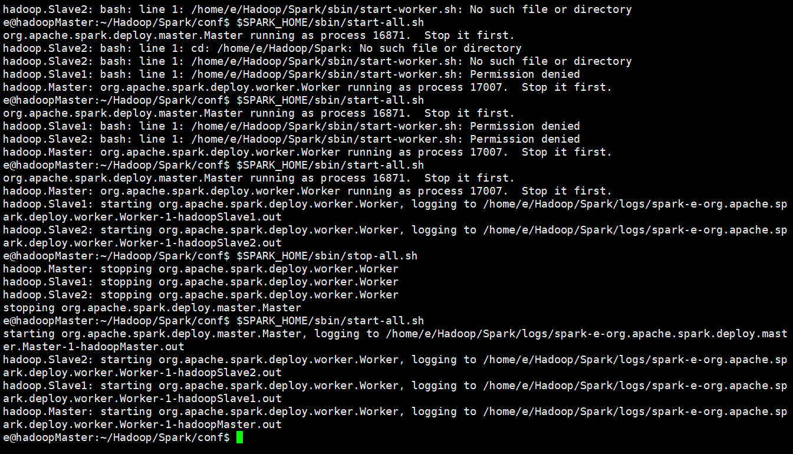
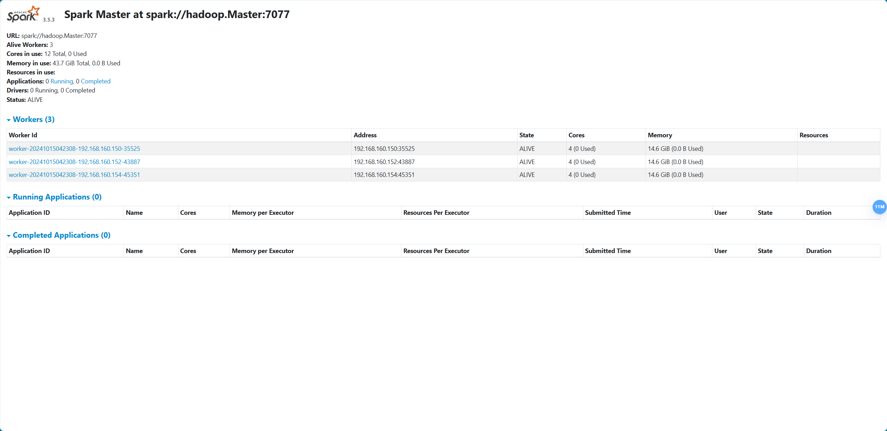

# Apache Hadoop + Apache Spark 部署指南

## 准备工作

### 说明

本项目参考官方文档部署并均使用最新版本。此处由于 Apache Hadoop 和 Apache Hadoop 的原生包较大，这里只提供如下配置文件供大家替换：

`hadoop/etc/hadoop`：该目录下是 Hadoop 的核心配置文件，需要根据自己的实际情况修改内容，具体内容见下文。Hadoop 的其他目录无需改动。

`Spark/conf`：该目录是 Spark 的核心配置文件，需要根据自己的实际情况修改，具体内容见下文。Spark 的其他目录无需改动。

请下载 Hadoop 包和 Spark 包，并参考这两个文件夹的内容修改自己的配置文件。

- Hadoop：[hadoop](https://www.apache.org/dyn/closer.cgi/hadoop/common/hadoop-3.4.0/hadoop-3.4.0-src.tar.gz)
- Spark：[spark](https://spark.apache.org/downloads.html)

### 环境概述

对于三个节点（虚拟机），每个虚拟机需要完成以下目标：
1. Ubuntu 24.04
2. 具有不同的固定 IP
3. 均已经安装 Java JDK 8

对于安装了 Spark 的主机，需要额外实现：

1. 安装 Python3，及 Numpy 和 FastAPI

## Apache Hadoop 安装

## Apache Spark 安装

### 配置 Spark 集群

编辑 Spark 环境文档，指定 Hadoop 服务位置和 Java 环境位置。

``` bash
# Spark 原生配置文档均为 template 文件，需要先复制一份

cd ~/Hadoop/Spark/conf
cp ./spark-env.sh.template ./spark-env.sh
nano ./spark-env.sh
```

在文件末尾添加如下内容：

``` bash
# spark-env.sh
export SPARK_MASTER_HOST='hadoop.Master'
export JAVA_HOME=/opt/java
export HADOOP_CONF_DIR=/home/e/Hadoop/hadoop/etc/hadoop
```

编辑 `workers`，声明 Spark 集群包含的服务器内容。

``` bash
cp ./workers.template workers
nano ./workers
```

注意，此处填写的是 IP 地址，但由于已经在 hosts 文件夹中设置了域名，所以此处填写了域名。

``` bash
# 在最后写入如下内容
hadoop.Master  # 192.168.160.150
hadoop.Slave1  # 192.168.160.152
hadoop.Slave2  # 192.168.160.154
```

### 配置环境变量

```bash
# 编辑用户环境变量
vim ~/.bashrc

# 加入如下内容，
export SPARK_HOME=/path/to/Spark  # 需要修改为你自己的Spark目录
export PATH=$SPARK_HOME/bin:$PATH

# 刷新 bash
source ~/.bashrc

# 验证是否成功
spark-submit --version

# 启动集群
$SPARK_HOME/sbin/start-all.sh
```

启动成功截图：



访问 `http://hadoop.Master:8080` 即可查看集群状态。



## 运行示例模型

1. 编写训练文件，样例参考 [TSLR](https://github.com/Emoreday/CC-LSTR/tree/main/TSLR)。
2. 将文件上传至 HDFS
```bash
hdfs dfs -mkdir /dataset
hdfs dfs -mkdir /dataset/wic
hdfs dfs -put ./test-00000-of-00001.parquet /dataset/wic/
hdfs dfs -put ./train-00000-of-00001.parquet /dataset/wic/
hdfs dfs -put ./validation-00000-of-00001.parquet /dataset/wic/
```
3. 运行训练评估程序

```bash
spark-submit --master spark://hadoop.Master:7077 ./my_spark.py
```

参考评估结果如下：

```bash
+---+--------------------+--------------------+-----+----------+
|idx|           sentence1|           sentence2|label|prediction|
+---+--------------------+--------------------+-----+----------+
|  0|    room and board .|he nailed boards ...|    0|       0.0|
|  1| circulate a rumor .|this letter is be...|    0|       0.0|
|  2|       hook a fish .|he hooked a snake...|    1|       0.0|
|  3|for recreation he...|drug abuse is oft...|    1|       1.0|
|  4|making a hobby of...|a royal family li...|    0|       1.0|
+---+--------------------+--------------------+-----+----------+
```

4. 多截几张图交差吧。
