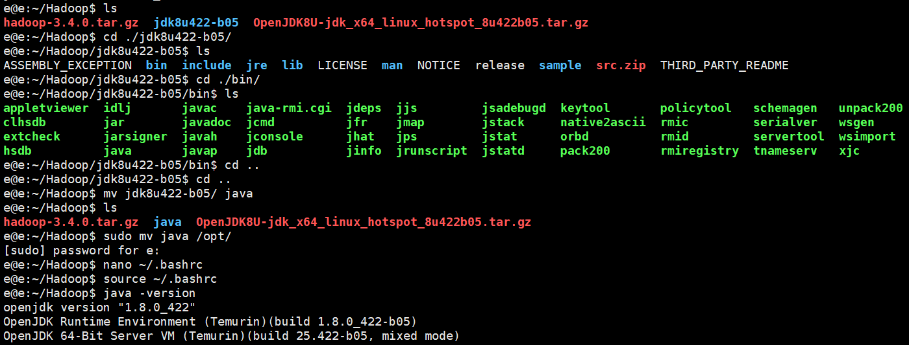

# 2024 年秋 GDUT 云计算大作业 CC-LSTR

⭐如果这对你有帮助，请留下一个 star⭐

>  注意：目前我们已经注意到了若干问题，部分内容可能更新。如果关于我涉及的工作存在不完整的部分（比较忙），请联系我补全。如果是我没涉及到的内容，酌情考虑。

## 项目概述

CC-LSTR（Cloud Computer - Text Relevance Logistic Classifier）是使用 Apache Hadoop + Apache Spark 基于线性回归模型完成对语言关联度二分类分析。训练集采用 WIC ，精度约为53%，作为二分类模型力压OPT-6.7b三个百分点，并且运行速度不在一个量级，故某种意义上还挺成功的。

Web界面可以访问 [语言关联分析](wao.emorepitg.top)，但由于后端没有运行，所以这里只展示 Web 界面。

> 注意：线性回归模型根本不可能完成语言关联度二分类，因为语言类问题不太可能放到一个二维平面并取一个超平面，所以该工作仅供学习云计算，要精度可以自己研究研究如何利用 Spark 实现 Transformer。

## 食用方法

1. 部署 Apache Hadoop + Apache Spark 集群，详见 [Hadoop](https://github.com/Emoreday/CC-LSTR/tree/main/Hadoop) 文件夹。
2. 训练以及部署，详见 TSLR 文件夹。
3. 启动 WebUI 界面，时间关系暂时没打算写。

## 环境配置及说明

### 固定IP设置
使用VMwarm安装Apache Hadoop环境时，需要固定每个虚拟机的IP地址，避免动态IP变动带来的连接丢失问题。固定IP地址需要使用软件包net-tools，安装方式如下：
sudo apt update  # 好习惯
sudo apt install net-tools -y安装完成后，便可使用命令查看并记录本机网卡名(ens33)、当前IP(inet)、子网掩码(netmask)、网关地址(Gateway)等信息，这些信息将用于固定IP。
```bash
ifconfig
# 返回内容：
# ens33: flags=4163<UP,BROADCAST,RUNNING,MULTICAST>  mtu 1500
#         inet 192.168.160.128  netmask 255.255.255.0  broadcast 192.168.160.255
#         inet6 fe80::20c:29ff:fe32:3e8b  prefixlen 64  scopeid 0x20<link>
#         ether 00:0c:29:32:3e:8b  txqueuelen 1000  (Ethernet)
#         RX packets 1184226  bytes 1612398323 (1.6 GB)
#         RX errors 0  dropped 0  overruns 0  frame 0
#         TX packets 211667  bytes 26752118 (26.7 MB)
#         TX errors 0  dropped 0 overruns 0  carrier 0  collisions 0
```
```bash
route -n
# 返回内容：
# Kernel IP routing table
# Destination      Gateway         Genmask         Flags Metric Ref    Use Iface
# 0.0.0.0          192.168.160.2   0.0.0.0         UG    100    0        0 ens33
# 192.168.160.0    0.0.0.0         255.255.255.0   U     100    0        0 ens33
# 192.168.160.2    0.0.0.0         255.255.255.255 UH    100    0        0 ens33
```

比如上述情况中，当前系统的网卡为ens33，IP为192.168.85.134，子网掩码为255.255.255.0，网关地址为 192.168.85.2。由于每台机器会出现不同的数据，所以请务必自己观察和处理。
得到上述信息后，即可修改配置文件来固定IP地址。使用如下命令备份并编辑IP地址配置文件（注意：新版本可能不是00-installer-config.yaml，有可能是xx-installer-config.yaml）：
```bash
cd /etc/netplan
sudo cp 00-installer-config.yaml 00-installer-config.yaml_before
sudo vim 00-installer-config.yaml
```
修改文件内容如下，修改完成后使用快捷键ctrl+x进入保存模式，在Save modified buffer提示时按Y确认保存，在File Name to Write ...提示时按回车键，完成保存操作：
```
network:
  ethernets:
    ens33:
      dhcp4: no  # true 改为 no
      addresses: [192.168.160.150/24]  # 此处是你希望使用的IP地址
      routes:
        - to: default
          via: 192.168.160.2  # 填写记录的网关
      nameservers:
        addresses: [8.8.8.8, 114.114.114.114]
  version: 2
```
此处我假设我希望将本机IP设置为192.168.160.150，则addresses字段填写[192.168.160.150/24]，示意固定的IP地址为多少。修改并保存完成后使用命令sudo netplan apply应用最新网络文档。若使用ssh连接虚拟机，则有可能断开连接（IP更改后连接丢失）。

### hosts 文件配置

输入如下命令进入编辑host：
```bash
sudo nano /etc/hosts
```

在文件末尾即可添加自己希望使用的IP域名映射对。本次实验我们固定了三个IP，此处分别赋予域名：

``` bash
# /etc/hosts
192.168.160.150 hadoop.Master
192.168.160.152 hadoop.Slave1
192.168.160.154 hadoop.Slave2
```

### 免密登录配置

免密登录将允许具有通行证的主机无需密码访问其他主机，Master主机控制Slave主机，具体实现是采用SSH免密登录。SSH免密登录需要使用公钥和私钥配对，当用户拥有公钥对应的私钥时，即可直接登录服务器。使用`ssh-keygen -t rsa`即可在服务器上生成一对密钥。生成密钥后，将公钥写入`~/.ssh/authorized_keys`文件，密钥妥善保存用于登录。

### Java环境配置

Apache Hadoop 使用 Java 环境开发，系统全系稳定兼容 Java 8，最新版本部分兼容 Java 11。登录网址 [Adoptium-JDK 8](https://adoptium.net/zh-CN/temurin/releases/?os=linux&package=jdk&version=8&arch=x64)，下载适用于Linux的JDK包。

下载完成后，可以使用scp命令或Xftp程序将文件上传至虚拟机。上传完成后打开对应目录，使用如下命令解压该软件包并移动到/opt目录下：

```bash
# JDK文件目录下
tar -zxvf ./OpenJDK8U-jdk_x64_linux_hotspot_8u422b05.tar.gz
mv ./OpenJDK8U-jdk_x64_linux_hotspot_8u422b05 /opt/java8
```

接着配置用户环境变量：

```bash
nano ~/.bashrc
```

打开文件后调整到最后一行，加入如下内容完成Java环境配置。修改完成后使用快捷键ctrl+x进入保存模式，在Save modified buffer提示时按Y确认保存，在File Name to Write ...提示时按回车键，完成保存操作。

```bash
export JAVA_Home=/opt/java8
export PATH=$JAVA_HOME/bin:$PATH
```

保存完成后，需要使用 `source ~/.bashrc` 命令重新加载环境变量，随后使用 `java -version` 命令即可验证Java环境是否配置正确，若出现如下倒数三行所示内容则表示Java环境配置成功。



## 贡献者
1. [Emoreday](https://github.com/Emoreday)
